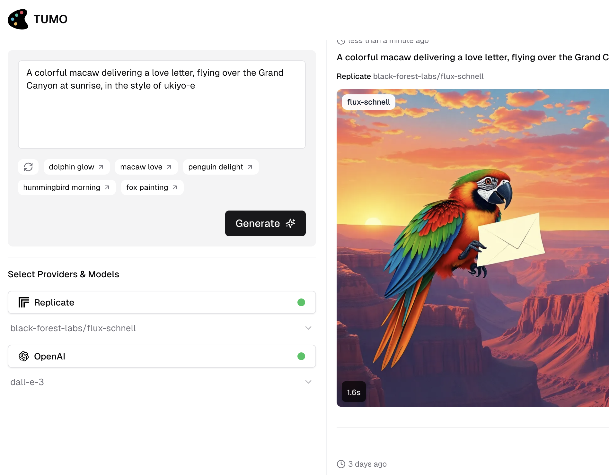

# Introduction

NextBook is built with [Nextra](https://nextra.site/) - a Next.js based static site generator.

It supports Markdown and React components ([MDX](/features/mdx)), automatically
generated [sidebar and anchor links](/get-started#sidebar-and-anchor-links),
file-system based routing, built-in syntax highlighting, image optimization,
custom layouts, i18n, and all the features you love about Next.js.

The markdown files should be put in the `src/content` directory.

The images should be put in the `public` directory, which can be inserted into markdown files by dragging and dropping the image into the markdown file while holding `shift` on Mac.

For example, the following is a screenshot of Tumo from [Takin.ai](https://takin.ai):

